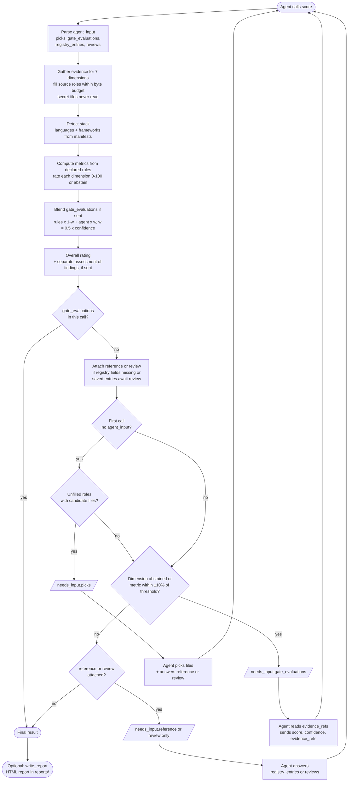

# Scoring session flow (MCP)

A scoring session is one to three `score` calls from the calling agent, then an optional
`write_report`. The engine never calls an LLM: every judgment in the flow comes from the calling
agent or the user, and every number is shown with its parts.

Source: `src/easy_verifier/adapters/mcp_server.py` (`score`) and
`src/easy_verifier/core/score.py` (`score_repository`).
The rules applied in the "Compute metrics" step are listed in
[`SCORING_RULES.md`](SCORING_RULES.md).

## Flow

## The rounds

| Call | Agent sends | Engine may ask |
|---|---|---|
| 1 | nothing (or findings) | `picks` if roles are unfilled but candidates exist; otherwise `gate_evaluations` if a dimension is gated |
| 2 | `agent_input` with picks | `gate_evaluations` only (picks are never asked twice) |
| 3 | same `agent_input` + `gate_evaluations` | nothing: this call always returns the final result |

`reference` (registry fields the detected stack lacks) and `review` (saved registry entries for the
user to approve, improve, or reject) ride along with whichever round is asked and add no round of
their own. Answers go back as `agent_input.registry_entries` and `agent_input.reviews`, and are
saved to the local registry (`/sot` in the container) so they are researched once per machine.

Findings, when passed, get a separate **assessment**. It is shown next to the rating with any
divergence and is never blended into it.

The CLI runs the same core but never asks: one pass, rules-only ratings, no `needs_input`.
